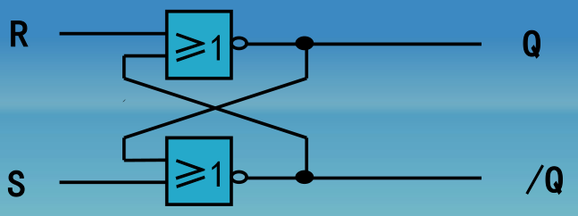
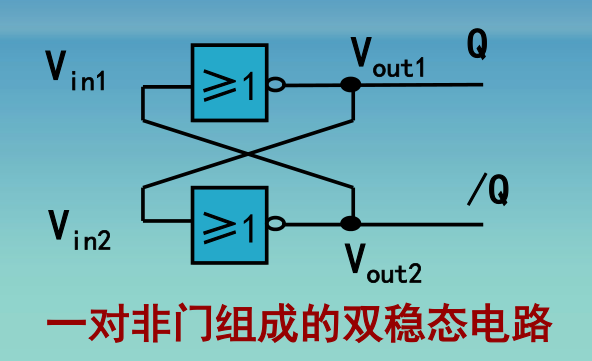

# 对RS锁存器的一次探索

​​

	对于如上图的或非 RS 锁存器其次态方程为式 1 $Q=S+\overline{R}Q$,单单从图上观察，**难以得出这个方程**，我的数模书上也没有解答。本人并没有在网络上试着查找答案。实际上我有且仅看过的相关文章为知乎 JoshCena 的[数字电路学习笔记（九）：初识锁存器](https://zhuanlan.zhihu.com/p/138572650)。另一个问题是一般而言（凭我的水平发表的爆论）在给出 RS 锁存器前，通常会给出

​​​

	这个电路的双稳态性质是容易看出的，问题在于 RS 锁存器的稳定性是如何得到的？对于这两个问题，我进行了如下探索：

首先建立现态和次态的逻辑表达式 2：

$$
\begin{matrix}
Q_{n+1}=\overline{R+\overline{Q_{n}}} \\
\overline{Q_{n+1}}=\overline{Q_{n}+S}
\end{matrix}
$$

可以看出 $Q_{n+1}$ 仅仅与 $R$ 和 $\overline{Q_{n}}$ 有关，那么式 1 中的 S 是从何处来的。稍加思考，参考式 2 的 $\overline{Q_{n+1}}$ 可以知道 S 来自 $\overline{Q_{n}}$。由于式二递推的特点，可以推测如果从起始的 R、S、Q、$\overline{Q}$ 经过有限次迭代可以得到稳定不变的 $Q_{n+1}$ 和 $\overline{Q_{n+1}}$。同时亦可猜测这个迭代的次数应该是比较小的，不然也不会有 R=1 后 Q 立刻变为 0 的描述。

迭代过程如下（省略部分运算）：

$$
\begin{matrix}
Q_1=\overline{R}Q\\
\overline{Q_1}=\bar{Q}\bar{S}\\
Q_2=\overline{R}Q+\overline{R}S\\
\overline{Q_2}=\bar{Q}\bar{S}+R\overline{S} \\
Q_3=\overline{R}Q+\overline{R}S\\
\overline{Q_3}=\bar{Q}\bar{S}+R\overline{S} \\
.......\\
Q_n=\overline{R}Q+\overline{R}S\\
\overline{Q_n}=\bar{Q}\bar{S}+R\overline{S} \\
\end{matrix}
$$

对，你没有看错，从第二次迭代开始，Q 与\Q 就一直不变。我们也可以很粗暴地将这两步合为一步，得到一个看似错误的正解。  
即式三： $Q_n=\overline{R}Q+\overline{R}S$,$\overline{Q_n}=\bar{Q}\bar{S}+R\overline{S}$到这一步，问题似乎解决了。但是式3为 $Q_n=\overline{R}Q+\overline{R}S$，式1为$Q=S+\overline{R}Q$，为什么二者有所差距呢？难道两者的逻辑式相等画卡诺图可以看出二者范围不同。回忆对Q和\Q的要求，除了稳定还要求Q与\Q不同。由式3不同初始R、S对应的真值表：

|S|R|Q|$Q_{n}$ |$\overline{Q_n}$ |
| ---| ---| ---| ------| ------|
|0|0|x|不变|不变|
|0|1|x|0|1|
|1|0|x|1|0|
|1|1|x|0|0|

很明显$SR=1$不满足条件。因此需要约束方程：$SR=0$。而卡诺图中$S$比$\overline{R}S$多出的部分为$RS=11$,加上约束条件后,在简化式3的同时得到了与式1相同的效果.我觉得说到这个地步足够理解RS锁存器了😀

‍
